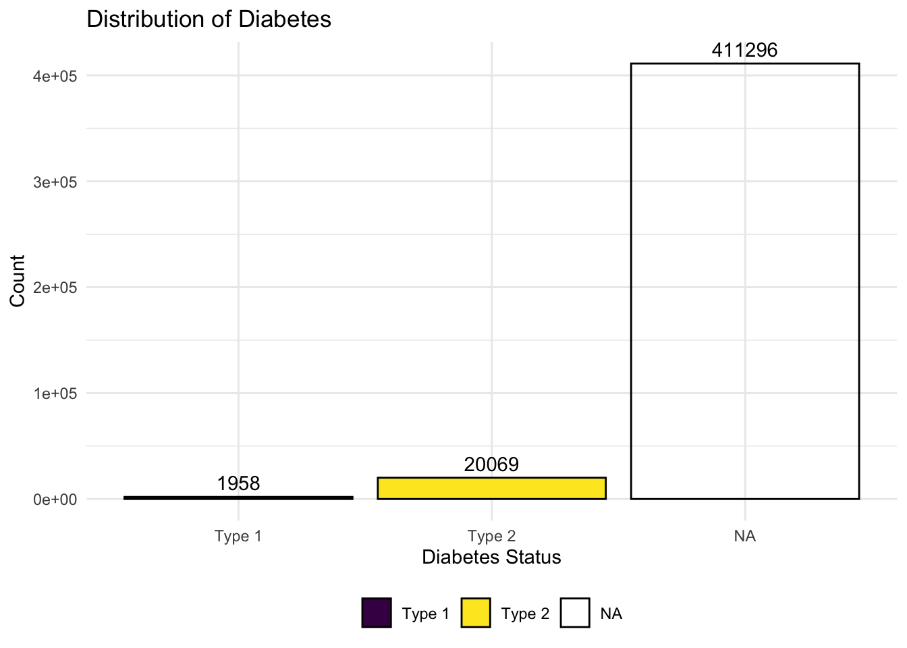
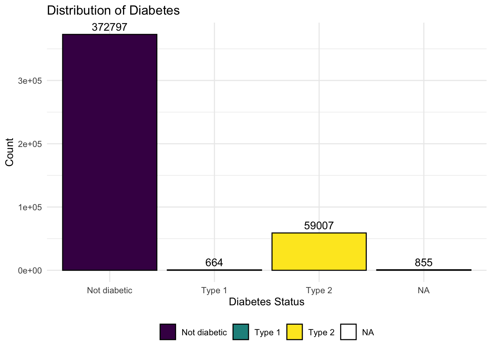
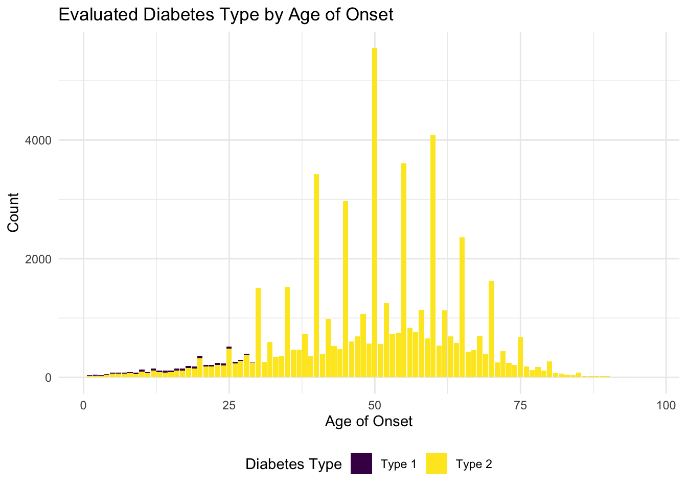
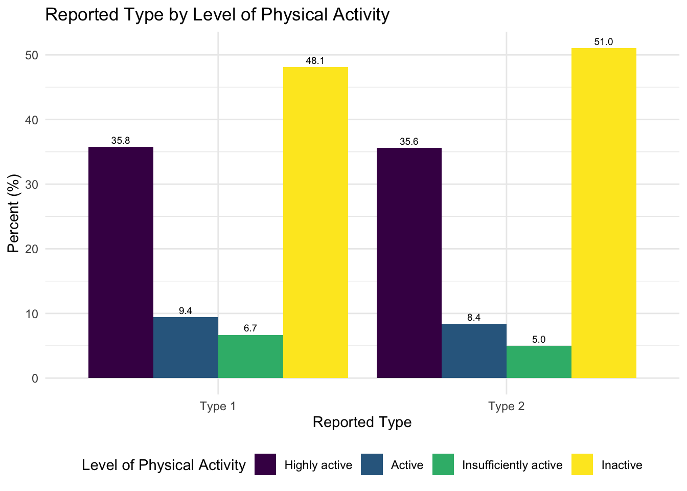
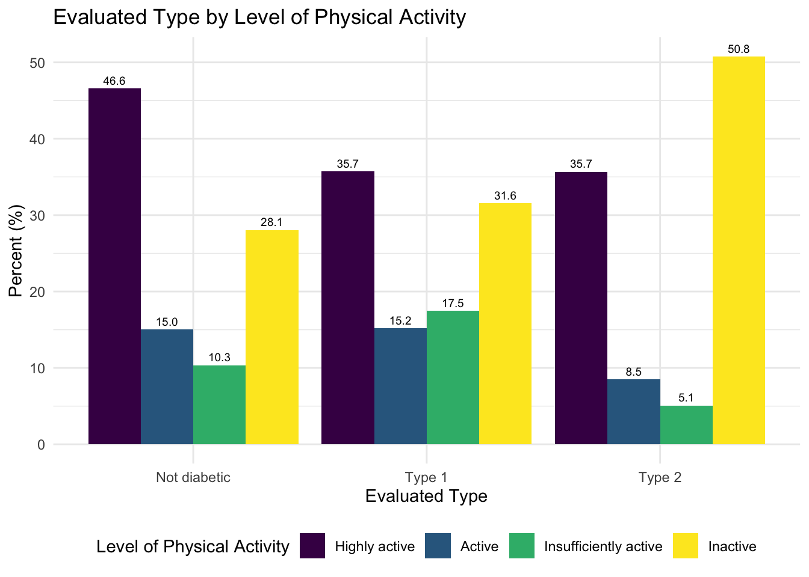

# Overview 

In this project, we aim to analyze Type II Diabetes (T2D) in the U.S. Our group’s inherent interest in public health and chronic disease epidemiology prompts us to explore the context of T2D in this project. Our analysis is informed by a non-scoping literature review to understand previous analysis performed on the distribution and prevalence of T2D in the United States. Most relevantly, our approach and reasoning for the variables we chose for our EDA and regression models are inspired by [Cicek et al.(2021)](https://www.sciencedirect.com/science/article/pii/S0889852921000463?via%3Dihub) in their paper. In addition, all group members are simultaneously enrolled in BIST8130: Biostatistical Methods I. As such, we wanted to apply the statistical analysis skills and methods learned in that class, to this project. 

# Motivation

T2D is among the leading causes of mortality in the U.S. Through our project, we want to consider potential the impact of covariates and comorbidities through linear and multivariate regression models.  

# Related Work / Literature Review

Type II Diabetes remains a prevalent and prioritized issue in both public health and clinical medicine fields. The disease is characterized by two challenges in the biochemical pathway to insulin, the body’s hormone involved in transporting sugar to our cells. Patients with T2D have a pancreas that both produces insufficient amounts of insulin and whose cells react poorly to the insulin that is produced [2]. As a result, their cells take in less amounts of sugar. These cellular mechanisms differentiate it from Type I Diabetes, in which the patient’s pancreas is unable to produce insulin. 

The US Centers for Disease Control and Prevention estimates that nearly 10% of Americans - that is, 38 million people, are currently diagnosed with diabetes, of which close to 95% have type 2 diabetes [1]. Our initial questions and goals of this project were to analyze the relationship between previously identified risk factors for T2D, such as being overweight, having a family history, and physical inactivity, and the prevalence of the disease [1]. 

In addition to the risk factors identified by the CDC, previous research has found associations between the development of T2D and other cardiometabolic comorbidities, including hypertension and ischemic heart disease, in addition to depression and osteoarthritis [3]. The temporality of these disease developments continues to remain of interest in scientific research, as understanding the role of one disease in the development of the other would offer valuable information to public health, medical, and scientific experts looking for interventions that optimize a reduction in disease development. As a cross-sectional, ecological study, our project will unfortunately not be able to offer insight into the causality between comorbidities and type II diabetes, but will contribute to knowledge on observed associations between patients with multimorbidity. 

_The diagram below depicts a variety of risk factors associated with diabetes (Cicek et al., 2021)._

# Guiding Questions

Through our analysis, we aim to answer the following questions:

- How prevalent is diabetes in the United States, as well as the prevalence of Type 2 diabetes in particular? 
- Which lifestyle factors and comorbidities have the strongest relationship with T2D? Is it justified to make generalizations about the age of onset for Type 2 Diabetes? 
- By analyzing our data source, can we draw conclusions about how comprehensive common T2D questionnaires are?

# Data

### Source

Our data comes from the Behavioral Risk Factor Surveillance System [(BRFSS)](https://www.cdc.gov/brfss/annual_data/annual_2023.html) developed and aggregated by the US Centers for Disease and Prevention (CDC). The data captures diabetes data as related to demographics, individual behaviors, chronic health conditions, health-care access, and use of preventive services. 

The primary purpose of the BRFSS was to inform public health policy, monitor health trends, and support the development of health interventions. It was one of the largest continuously conducted telephone health surveys in the world, providing critical insights into the health status and needs of U.S. residents. The BRFSS used Computer-Assisted Telephone Interviewing (CATI) systems to collect data, with respondents selected through a probability sampling method to ensure results are representative of the U.S. adult population. In 2023, 54 states and territories participated, though data from Pennsylvania and Kentucky were excluded due to insufficient collection. Data collection occurred year-round, spanning all 12 months, and interviews were conducted seven days a week, both during the day and in the evening, to maximize response rates. Interviews lasted an average of 17 minutes for the core questionnaire, with additional time required for optional modules and state-specific questions. The survey incorporated both landline and cellular samples, adjusting for demographic factors such as age, gender, race/ethnicity, education, and marital status through a process known as iterative proportional fitting or raking. 

This methodology ensured that the BRFSS data was nationally representative and reflective of the diverse U.S. population, making it a valuable tool for understanding and addressing public health challenges.

### Import
To clean the data, we first had to import the large XPT file and select only the variables we were interested in analyzing related to diabetes. We selected variables after conducting a thorough literature review to identify which factors and comorbidities were the most relevant to a diabetes (and specifically T2D) diagnosis. 

*Below is a graphic that shows the general reasoning behind our choice of variables, as developed in [Cicek et. al](https://www.sciencedirect.com/science/article/pii/S0889852921000463?via%3Dihub#fig2).*

### Cleaning
For the coding process of cleaning the data, we recoded variables with responses such as “refusal”, “don’t know/not sure”, and missing as NA. Binary variables were converted from (0,1) to (No, Yes). Other variables, including binary variables, were also re-coded as factor variables. We identified three main variables for analysis related to diabetes: `has_diabetes`, `diab_type`, and `eval_type`. 

**`has_diabetes`**: This variable describes the people in the survey who responded after being asked the question, "Have you ever been told you had diabetes?" Overall, 432,339 people responded to this question.

**`diab_type`**: This variable comes directly from the dataset, where respondents who were diabetic per the `has_diabetes` question were asked "What type of diabetes do you have?" Only 22,027 participants answered this question out of the 59,786 people who responded that they had diabetes. Since there are over 60% of respondents unaccounted for, this measure may not tell us enough about risk factors or comorbidities of T2D in the general population.

**`eval_type`**: Due to the missing data for `diab_type`, we created another variable `eval_type` that describes the person's diabetes type by using other demographic information from this dataset. We used [this paper](https://www.cdc.gov/pcd/issues/2019/19_0109.htm) published by the CDC that used the same BRFSS survey from 2014 to classify T2D diagnosis. In this paper, they classified a survey respondent to have type II diabetes if the respondent was older than 30, not pregnant, and answered yes to the question “Have you ever been told you have diabetes?” 

We then classified a respondent to have type II diabetes if the respondent was older than 30, not pregnant, and were diabetic as per the `has_diabetes` question. We classified a respondent to have type I diabetes if the respondent was younger than 30 and were diabetic as per the `has_diabetes` question.

The final cleaned dataset `cleaned_diabetes_data.csv` contains 40 columns and 433,323 rows. To access this data, users can find it in our GitHub repo at `data/cleaned_diabetes_data.csv`. A metadata table with a description and coding of each variable in the cleaned dataset can be found in Appendix A.

# Exploratory Data Analysis

### Overall distribution
We started by examining the overall distributions of each of our outcome variables. 

Of the 433,323 respondents, 59,786 are actually diabetic.

Of the people that said they had diabetes, we have just over ~20K responses regarding the type of diabetes they have, and over ~410K missing responses. Because of this missing data, we more heavily relied on the evaluated type. However, it is worth noting that we are actively excluding people diagnosed with type I diabetes after the age of 30 (as shown below).

In the graphs above, we could conclude that the overall distribution is relatively normal related to the age of onset of diabetes diagnosis. However, if we just consider real-time age and diabetes, we see a different distribution. In the graph below, we see that as age increases, the count of diabetes cases increase (using the has_diabetes variable), with the highest number of cases being in the 65-74 age group. The number of diabetes cases decrease slightly after age 74.

### Demographics
We also explored other demographic information in relation to diabetes diagnosis. We compared each factor to one of our three outcome variables, has_diabetes, diab_type, and eval_type, to identify the overarching relationship between specific demographics and diabetes, along with similarities and differences between the various kinds of diagnosis.

People with better health and physical activity practices have fewer diabetes diagnoses. Between type I and type II diagnoses, physical activity is about the same, based on the reported type. On the other hand, type II diagnoses have a higher percentage of inactive people, based on the evaluated type.

People with (at least) a college degree make up a larger proportion of the sample of people who are not diabetic than the sample of people who are diabetic. Surprisingly, according to the evaluated type variable, a significantly larger percentage of people who graduated high school have type I diabetes, compared to the percentage of people who graduated high school with type II diabetes.

### Related Factors 

We also explored related factors to diabetes diagnosis, one of which being blood pressure.

People with low/normal blood pressure were represented much more in the group of people who are diabetic compared to any other group. There is a slight increase in high blood representation percentage in the type I group compared to the type II group in the reported cases, but that is heightened in comparing the evaluated type variable.

We originally explored high blood sugar and A1C checks in this section, but decided not to publish those models because only people with diabetes (as per has_diabetes) were asked this question, severely skewing our results.

### Comorbidities
Finally, we explored comorbidities known to be shared with diabetes diagnosis.

A larger proportion of people with diabetes also have kidney disease than other groups. The reported type shows no significant difference in diagnosis across type of diabetes, but the evaluated type shows that people with kidney disease are more highly represented in the group with type II diabetes.

Blindness is slightly more common in people who have diabetes compared to people who are not diabetic, but we see some opposition between reported and evaluated type I and II diabetes status.

# Regression

One of our goals for this project was to explore associations between diabetes prevalence, type of diabetes, and various lifestyle factors through regression. When deciding which variables to use as predictive factors in our generalized linear models, we looked to existing literature about lifestyle factors associated with diabetes and also considered how much of the data for that variable was present or missing in our dataset. On the [Regression](regression_final.html) page of our website, we have briefly defined the variables we used as predictors in our models and have also provided peer-reviewed sources as evidence to support our decisions. 

We used generalized linear models to predict two outcomes:

* `has_diabetes`: Does a study participant have any form of diabetes?
* `diab_type`: If a study participant does have diabetes, then which type?

Due to the formatting and order of the questions in the questionnaire, some variables were only asked of certain people, leading to a large amount of missing values. Since so much of our data was missing, we decided to run some tests for the significance of the missing data. First we ranked the variables of interest by rate of missingness. We decided to keep those that had at least 80% of the data present. Next, we used the chi square test for missingness to compare variables with differing rates of missingness and see if they could be interacting or if their missingness could be related (not at random). After these tests, we found possible interactions between COVID-19 and bronchitis, both of which are independently known to increase diabetes risk. We ran one more chi square test to make sure this interaction was statistically significant.

At this point we created two Generalized Linear Models (GLM) using sex, age, obesity, race, good health, kidney disease, stroke, bronchitis, and COVID-19 as main effects, with COVID-19 and bronchitis as an interaction. We chose this model to try to prevent overfitting and handle distributions that are not Gaussian, such as that of variables like age, which is skewed due to Type 2 Diabetes being more common in older adults.

Through this process, we found that several lifestyle and demographic variables were strongly associated with these outcomes. These included age, race, sex, obesity, overall health, and certain comorbidities (ie. covid, bronchitis, stroke).

The first GLM modeled the risk of any type of diabetes, and the second one modeled the risk of Type 2 Diabetes in particular. We encountered a significant limitation for the second model because almost 100 times as many people reported Type 2 Diabetes as opposed to Type 1, so our model as proposed converged and was not significant in analyzing comparative risk.

In order to assess our models, we performed 100-fold cross-validation and extracted RMSE for each model. From the results of our cross validation and error assessment, we saw that our second model, which predicts `diab_type` appeared to perform relatively well, especially considering the volume of missing data we were dealing with. This model had a mean RMSE of less than 30% across the 100-fold validation we performed.

On the other hand, we saw that there were likely some issues with the first model, which predicts `has_diabetes`. The mean RMSE appears to be very low, close to 0, which is highly unrealistic. It hints at deeper issues within the model, perhaps stemming from the unusually low p-values of significance shown by several of the predictor variables of that model. Unfortunately, due to limited timeframe and project scope, we were not able to pursue this issue further. In future exploration, we would dedicate more time to investigating, correcting, and refining our models.

Some other limitations for regression include linearity, independence, multicollinearity, and homoscedasticity. Predictors and outcomes may have a non-linear relationship, and our model may not properly account for those. Additionally, outliers and observations being dependent on each other can cause misleading results. Multicollinearity, or predictors being correlated with one another, can also inflate standard error and coefficient estimates. Additionally, if the variance of residuals is not constant, or not homoscedastic, our results could be biased. 

# Discussion

### How prevalent is diabetes in the United States, as well as the prevalence of Type 2 diabetes in particular? 

Overall, the prevalence of diabetes in 2023 across the U.S. and its territories was 13.8%, assuming our dataset was representative of this population. The lowest prevalence of diabetes was in Colorado (9.3%) and the highest prevalence was in West Virginia. Of the people with diabetes, reportedly over 90% have type II diabetes (based on the results of the `diab_type` outcome). Using our evaluation of diabetes type (eval_type), 98% of people in the US have type II diabetes.

### Which lifestyle factors and comorbidities have the strongest relationship with T2D? Is it justified to make generalizations about the age of onset for Type 2 Diabetes? 

As investigated in our exploratory data analysis, we identified multiple comorbidities and lifestyle factors that have a high correlation with a diabetes diagnosis, and some also with a specifically significant relationship with type II diabetes. People with less than good health and generally inactive physical lifestyles are more represented in the diabetic group. Less than good health tend to be similar across types, but lower physical activity is more heavily represented in the type II group. Overall, we can note that the type I and type II split are fairly similar for all lifestyle factors, but generally, since the split is higher in our evaluated type variable (98% type II vs. 2% type I), there is higher representation of every comorbidity or lifestyle in the type II group. 

Two factors that did not follow this pattern were depression and blindness. In both of these cases, respondents who answered yes were represented more in the type I group than the type II group. It is worth noting that the results were very similar across all groups for has_diabetes, as well as both types for diab_type. Therefore, these results may have been skewed by other factors, such as age, pregnancy status, and gender, all of which were also determinants for the evaluated type variable.

### By analyzing our data source, can we draw conclusions about how comprehensive common T2D questionnaires are?

The best way that we were able to analyze the data source was by comparing these different outcome variables. Overall, has_diabetes performed well in our models and led to generally fair models. However, as seen in our EDA, there were some differences in performance for evaluated and reported type.

Overall, the reported and evaluated type variables perform similarly in identifying any significant differences in type across different lifestyle factors and comorbidities. However, the eval_type results in higher skews in either diagnosis compared to the reported type. Suppose a factor is associated with type II more than it is associated with type I in the reported type. In that case, it is heavily skewed towards type II in the evaluated type comparison. If a factor is generally associated with both, it is more heavily skewed towards type I. This can be dangerous in performing significance test and may be one reason for why our models are generally inconclusive.

# Limitations 

As with any analysis of external data, our project too, faced limitations because of restrictions in our data source. 

Despite being conducted by the U.S. CDC, the data was not as comprehensive as we had hoped and we were limited by the narrow focus of some survey questions and a lack of strict follow-up among participants. No questions related to family history or environmental exposures were asked, which would be relevant to better being able to diagnose respondents with type I diabetes.

Taking a closer look at our data, we are missing ~40,000 rows related to the specific type of diabetes diagnosis (difference between has_diabetes == Diabetes and diab_type != NA). Because of this, we felt the need to create a new variable that could better represent our population. We were not sure imputation would be the best way to handle this because of the large amount of missing data, so we decided to depend on another data source to create a justifiable evaluated variable. However, the constraints of the variable that were defined in our literature review caused us to exclude any respondents above the age of 30 who were diagnosed with type I diabetes as per the reported type variable. Therefore, the distribution of the evaluated type is skewed heavily towards type II diagnosis for certain age groups and demographics. Moving forward, the constraints on the onset can be a major limitation for all of our analysis. 

In addition, the metrics of some questions were unclear and it was unknown how many participants and/or what subgroup of participants were asked a question. For example, inquiries regarding high blood sugar and A1C were only asked to people that did not have diabetes. Only people that were reported diabetic were asked if they had received an A1C-level check within the last 12 months. In addition, for the small subset of participants who were questioned, they were not mandated to report their specific A1C result. 

# References 

1. https://www.cdc.gov/diabetes/about/about-type-2-diabetes.html
2. https://www.mayoclinic.org/diseases-conditions/type-2-diabetes/symptoms-causes/syc-20351193
3. https://www.thelancet.com/journals/eclinm/article/PIIS2589-5370(22)00314-5/fulltext

