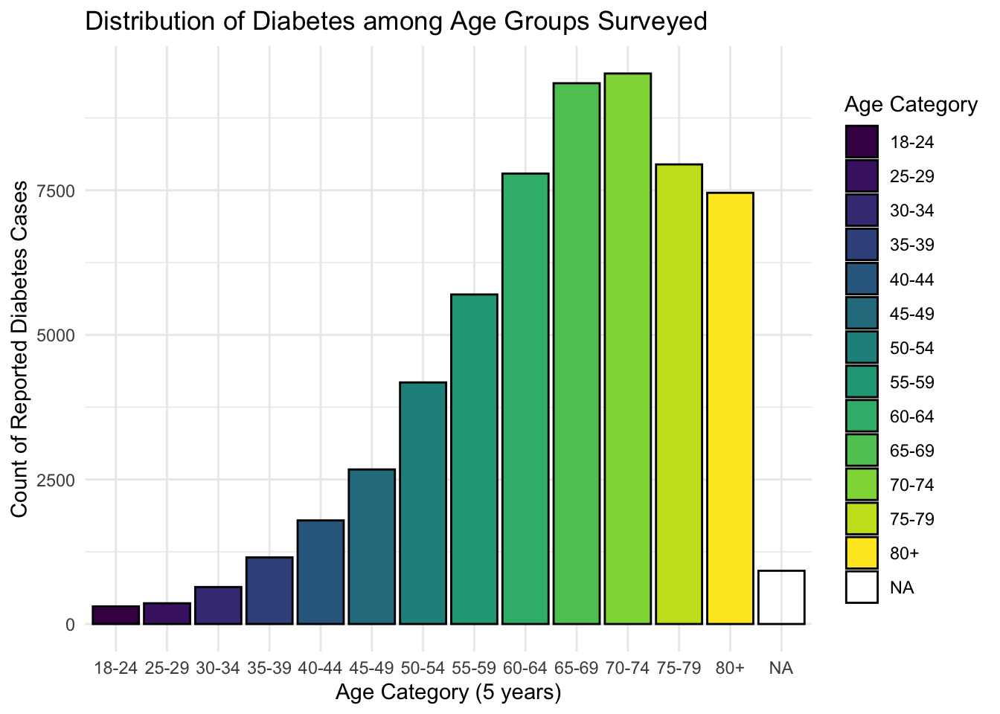
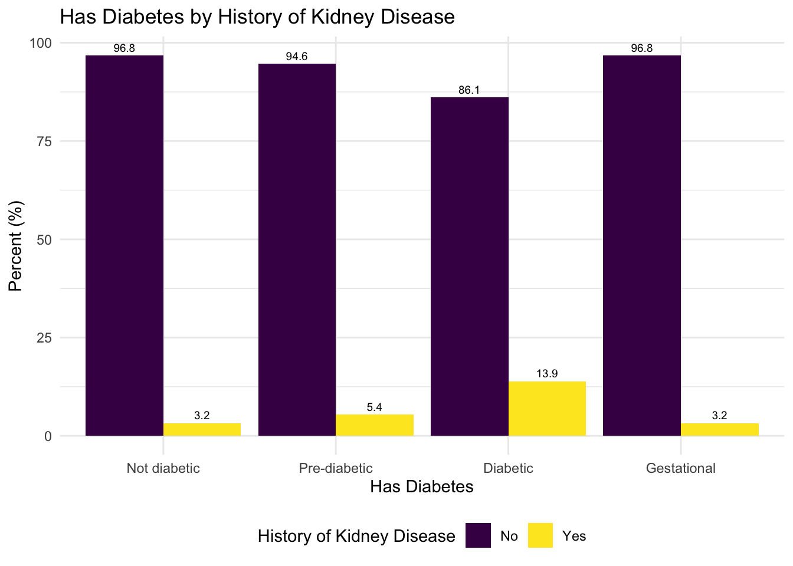

## Overview 

In this project, we aim to analyze Type II Diabetes (T2D) in the U.S. Our group’s inherent interest in public health and chronic disease epidemiology prompts us to explore the context of T2D in this project. Our analysis is informed by a non-scoping literature review to understand previous analysis performed on the distribution and prevalence of T2D in the United States. Most relevantly, our approach and reasoning for the variables we chose for our EDA and regression models are inspired by [Cicek et al.](https://www.sciencedirect.com/science/article/pii/S0889852921000463?via%3Dihub) (2021) in their paper. In addition, all group members are simultaneously enrolled in BIST8130: Biostatistical Methods I. As such, we wanted to apply the statistical analysis skills and methods learned in that class, to this project. 

In this project, we analyze Type II Diabetes (T2D) in the U.S through the development of a customizable dashboard that users can use to gain valuable information about their individual risk factors for T2D development based on the metrics they enter.  input specific criteria and our software would yield relevant data. Our group’s inherent interest in public health and chronic disease epidemiology prompts us to explore the context of T2D in this project. Our analysis is informed by a non-scoping literature review to understand previous analysis performed on the distribution and prevalence of T2D in the United States. Most relevantly, our approach and reasoning for the variables we chose for our EDA and regression models are inspired by [Meryem Cicek et al. (2021)](https://pmc.ncbi.nlm.nih.gov/articles/PMC8383848/) in their paper. In addition, all group members are simultaneously enrolled in BIST8130: Biostatistical Methods I. As such, we wanted to apply the statistical analysis skills and methods learned in that class, to this project. 

## Motivation

T2D is among the leading causes of mortality in the U.S. Through our project, we conduct an in-depth analysis of risk factors and lifestyle choices that contribute to its development. We consider potential the impact of covariates and comorbidities through linear and multivariate regression models. The deliverable includes graphical representations of regression models, maps of T2D across the US, and a customizable dashboard outlining potential risk factors for T2D. We hope to create a dashboard that provides a predictive estimate to help users understand how they can mitigate their risk and prevent developing T2D in the future.  

## Related Work (Literature Review)

## Initial Questions

Through our analysis, we aim to answer the following questions:

- How prevalent is diabetes in the United States, as well as the prevalence of Type 2 diabetes in particular? 
- Which lifestyle factors and comorbidities have the strongest relationship with T2D? Is it justified to make generalizations about the age of onset for Type 2 Diabetes? 
- By analyzing our data source, can we draw conclusions about how comprehensive common T2D questionnaires are?

## Data
### Source

Our data comes from the Behavioral Risk Factor Surveillance System [BRFSS](https://www.cdc.gov/brfss/annual_data/annual_2023.html) developed and aggregated by the US Centers for Disease and Prevention (CDC). The data captures diabetes data as related to demographics, individual behaviors, chronic health conditions, health-care access, and use of preventive services. This longitudinal survey has been collecting data since 1984, and was recently updated in September 2024. The data was only available in an 'xpt' format. Hence, to make the data accessible for import and analysis in R, the haven package was used to read the xpt file and then write into an accessible csv format. 

The Behavioral Risk Factor Surveillance System (BRFSS) was a nationwide survey conducted by the Centers for Disease Control and Prevention (CDC) to gather data on health-related risk behaviors, chronic health conditions, and preventive health practices among adults in the United States. The primary purpose of the BRFSS was to inform public health policy, monitor health trends, and support the development of health interventions. It was one of the largest continuously conducted telephone health surveys in the world, providing critical insights into the health status and needs of U.S. residents. The BRFSS used Computer-Assisted Telephone Interviewing (CATI) systems to collect data, with respondents selected through a probability sampling method to ensure results are representative of the U.S. adult population. In 2023, 54 states and territories participated, though data from Pennsylvania and Kentucky were excluded due to insufficient collection. Data collection occurred year-round, spanning all 12 months, and interviews were conducted seven days a week, both during the day and in the evening, to maximize response rates. Interviews lasted an average of 17 minutes for the core questionnaire, with additional time required for optional modules and state-specific questions. The survey incorporated both landline and cellular samples, adjusting for demographic factors such as age, gender, race/ethnicity, education, and marital status through a process known as iterative proportional fitting or raking. This methodology ensured that the BRFSS data was nationally representative and reflective of the diverse U.S. population, making it a valuable tool for understanding and addressing public health challenges.

### Import
To clean the data, we first had to import the large XPT file and select only the variables we were interested in analyzing related to diabetes. We selected variables after conducting a thorough literature review to identify which factors and comorbidities were the most relevant to a diabetes (and specifically T2D) diagnosis. 

### Cleaning
For the coding process of cleaning the data, we recoded variables with responses such as “refusal”, “don’t know/not sure”, and missing as NA. Binary variables were converted from (0,1) to (No, Yes). Other variables, including binary variables, were also re-coded as factor variables. We identified three main variables for analysis related to diabetes: `has_diabetes`, `diab_type`, and `eval_type`. 

**`has_diabetes`**: This variable describes the people in the survey who responded after being asked the question, "Have you ever been told you had diabetes?" Overall, 432,339 people responded to this question.

**`diab_type`**: This variable comes directly from the dataset, where respondents who were diabetic per the `has_diabetes` question were asked "What type of diabetes do you have?" Only 22,027 participants answered this question out of the 59,786 people who responded that they had diabetes. Since there are over 60% of respondents unaccounted for, this measure may not tell us enough about risk factors or comorbidities of T2D in the general population.

**`eval_type`**: Due to the missing data for `diab_type`, we created another variable `eval_type` that describes the person's diabetes type by using other demographic information from this dataset. We used [this paper](https://www.cdc.gov/pcd/issues/2019/19_0109.htm) published by the CDC that used the same BRFSS survey from 2014 to classify T2D diagnosis. In this paper, they classified a survey respondent to have type II diabetes if the respondent was older than 30, not pregnant, and answered yes to the question “Have you ever been told you have diabetes?” 

We then classified a respondent to have type II diabetes if the respondent was older than 30, not pregnant, and were diabetic as per the `has_diabetes` question. We classified a respondent to have type I diabetes if the respondent was younger than 30 and were diabetic as per the `has_diabetes` question.

The final cleaned dataset `cleaned_diabetes_data.csv` contains 40 columns and 433,323 rows. To access this data, users can find it in our GitHub repo at `data/cleaned_diabetes_data.csv`. A metadata table with a description and coding of each variable in the cleaned dataset can be found in Appendix A.

## Exploratory analysis

### Overall distribution
We started by examining the overall distributions of each of our outcome variables. 

Of the 433,323 respondents, 59,786 are actually diabetic.

Of the people that said they had diabetes, we have just over ~20K responses regarding the type of diabetes they have, and over ~410K missing responses. Because of this missing data, we more heavily relied on the evaluated type. However, it is worth noting that we are actively excluding people diagnosed with type I diabetes after the age of 30 (as shown below).

In the graphs above, we could conclude that the overall distribution is relatively normal related to the age of onset of diabetes diagnosis. However, if we just consider real-time age and diabetes, we see a different distribution. In the graph below, we see that as age increases, the count of diabetes cases increase (using the has_diabetes variable), with the highest number of cases being in the 65-74 age group. The number of diabetes cases decrease slightly after age 74.

### Demographics
We also explored other demographic information in relation to diabetes diagnosis. We compared each factor to one of our three outcome variables, has_diabetes, diab_type, and eval_type, to identify the overarching relationship between specific demographics and diabetes, along with similarities and differences between the various kinds of diagnosis.

People with better health and physical activity practices have fewer diabetes diagnoses. Between type I and type II diagnoses, physical activity is about the same, based on the reported type. On the other hand, type II diagnoses have a higher percentage of inactive people, based on the evaluated type.

People with (at least) a college degree make up a larger proportion of the sample of people who are not diabetic than the sample of people who are diabetic. Surprisingly, accordiing to the evaluated type variable, a significantly larger percentage of people who graduated high school have type I diabetes, compared to the percentage of people who graduated high school with type II diabetes.

### Related Factors 

We also explored related factors to diabetes diagnosis, one of which being blood pressure.

People with low/normal blood pressure were represented much more in the group of people who are diabetic compared to any other group. There is a slight increase in high blood representation percentage in the type I group compared to the type II group in the reported cases, but that is heightened in comparing the evaluated type variable.

We originally explored high blood sugar and A1C checks in this section, but decided not to publish those models because only people with diabetes (as per has_diabetes) were asked this question, severely skewing our results.

### Comorbidities
Finally, we explored comorbidities known to be shared with diabetes diagnosis.

A larger proportion of people with diabetes also have kidney disease than other groups. The reported type shows no significant difference in diagnosis across type of diabetes, but the evaluated type shows that people with kidney disease are more highly represented in the group with type II diabetes.

Blindness is slightly more common in people who have diabetes compared to people who are not diabetic, but we see some opposition between reported and evaluated type I and II diabetes status.

## Literature Review

One of our goals for this project was to explore associations between diabetes prevalence, type of diabetes, and various lifestyle factors through regression. To 

## Limitations 

As with any analysis, our project too, faced limitations because of restrictions in our data source. 

Despite being conducted by the U.S. CDC, the data was not as comprehensive as we had hoped and were limited by the narrow focus of some survey questions and a lack of strict follow-up among participants. No questions related to family history or environmental exposures were asked, which would be relevant to better being able to diagnose respondents with type I diabetes.

Taking a closer look at our data, we are missing ~40,000 rows related to the specific type of diabetes diagnosis (difference between has_diabetes == Diabetes and diab_type != NA). Because of this, we felt the need to create a new variable that could better represent our population. We were not sure imputation would be the best way to handle this because of the large amount of missing data, so we decided to depend on another data source to create a justifiable evaluated variable. However, the constraints of the variable that were defined in our literature review caused us to exclude any respondents above the age of 30 who were diagnosed with type I diabetes as per the reported type variable. Therefore, the distribution of the evaluated type is skewed heavily towards type II diagnosis for certain age groups and demographics. Moving forward, the constraints on the onset can be a major limitation for all of our analysis. 

In addition, the metrics of some questions were unclear and it was unknown how many participants and/or what subgroup of participants were asked a question. For example, inquiries regarding high blood sugar and A1C were only asked to people that did not have diabetes. Only people that were reported diabetic were asked if they had received an A1C-level check within the last 12 months. In addition, for the small subset of participants who were questioned, they were not mandated to report their specific A1C result. 